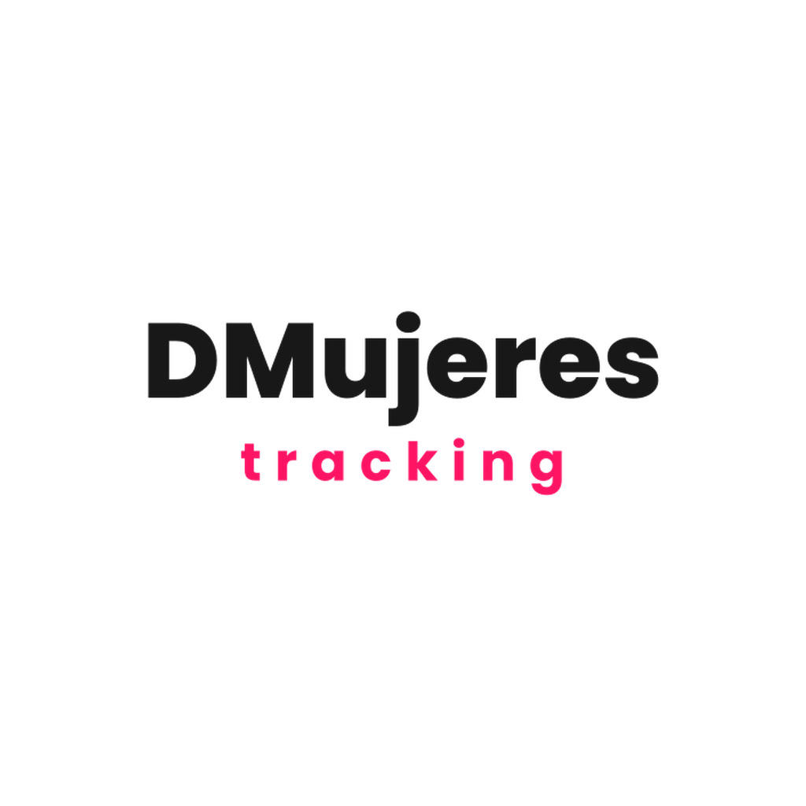

# DMujeres Traccar



Sistema de tracking GPS para la empresa Dmujeres. Fork de Traccar v6.14.5.

## Qué tiene

- Server en Java con MQTT para que la app reporte ubicación
- Dashboard web (React) para ver los dispositivos en el mapa
- App Android que manda GPS aunque la pantalla esté apagada
- Docker Compose para levantar todo (TimescaleDB, Redis, EMQX)

## Para levantar el entorno de desarrollo

```bash
cp .env.example .env
./infrastructure/scripts/dev.sh up
cd server && ./gradlew build
cd .. && ./infrastructure/scripts/run-server-dev.sh start
```

El dashboard queda en http://localhost:8082

## Para compilar la app Android

Necesitás Android SDK 34/35 y JDK 21.

```bash
cd mobile
./gradlew assembleDebug
```

El APK queda en `mobile/app/build/outputs/apk/debug/app-debug.apk`

## Estructura

```
server/          server Traccar (Java 21, Gradle)
dashboard/       panel web (React 19, Vite)
mobile/          app Android (Kotlin)
infrastructure/  Docker Compose y scripts
```

## Cómo funciona

La app manda posiciones por MQTT al server. El server las guarda en PostgreSQL y las manda al dashboard por WebSocket. Si no hay internet, la app guarda las posiciones en una cola local y las manda cuando se reconecta.

## Licencia

Apache 2.0 (mismo que Traccar upstream).
