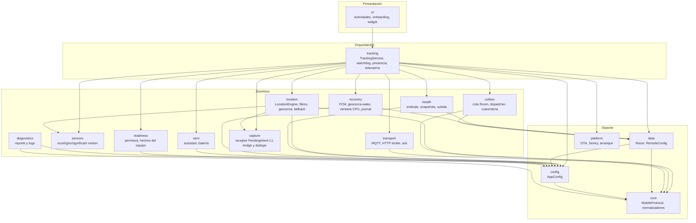
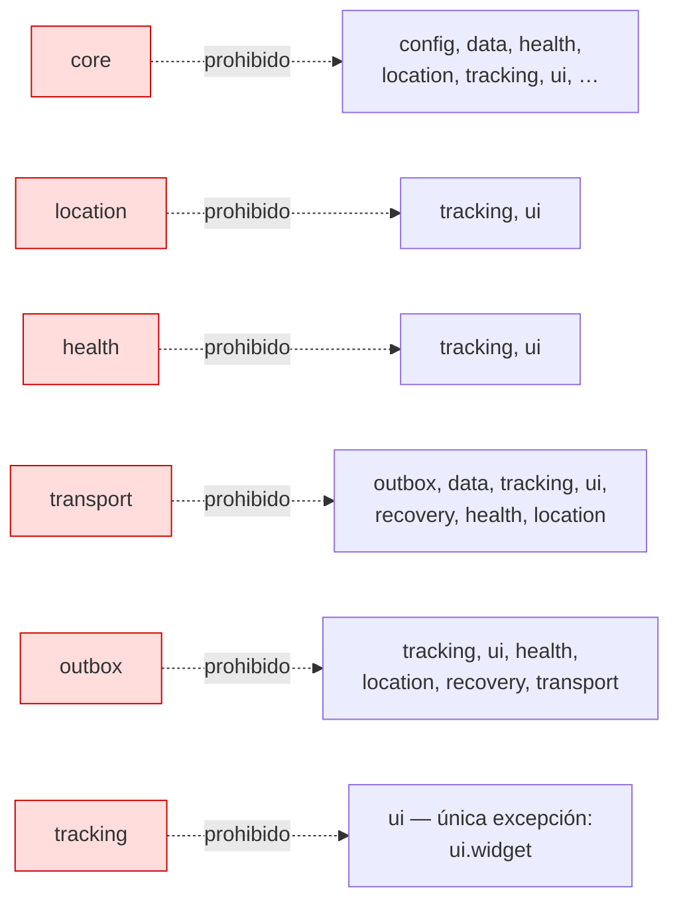
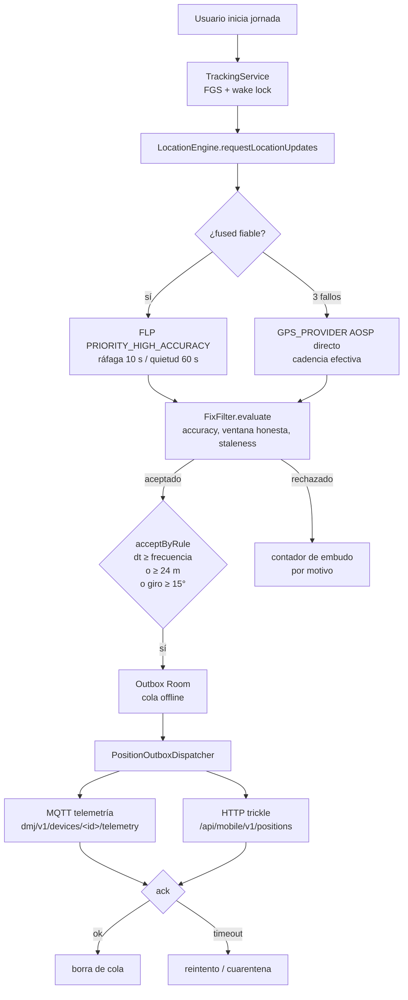
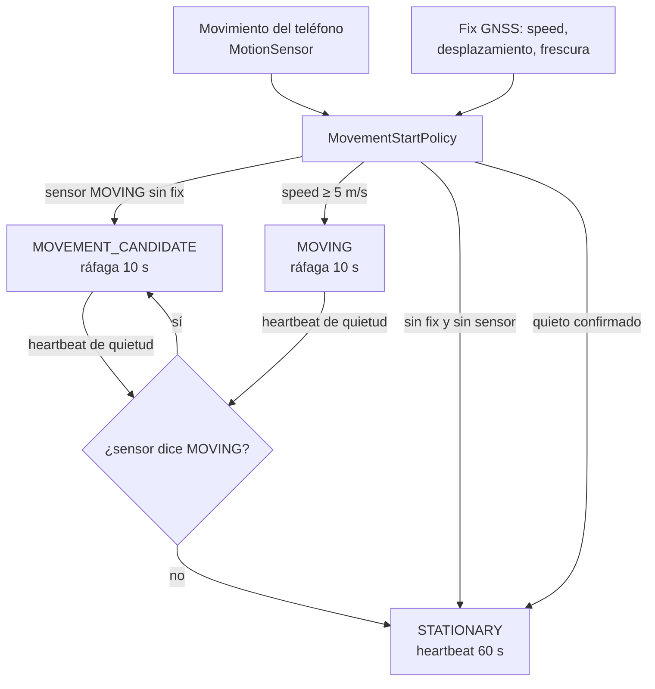
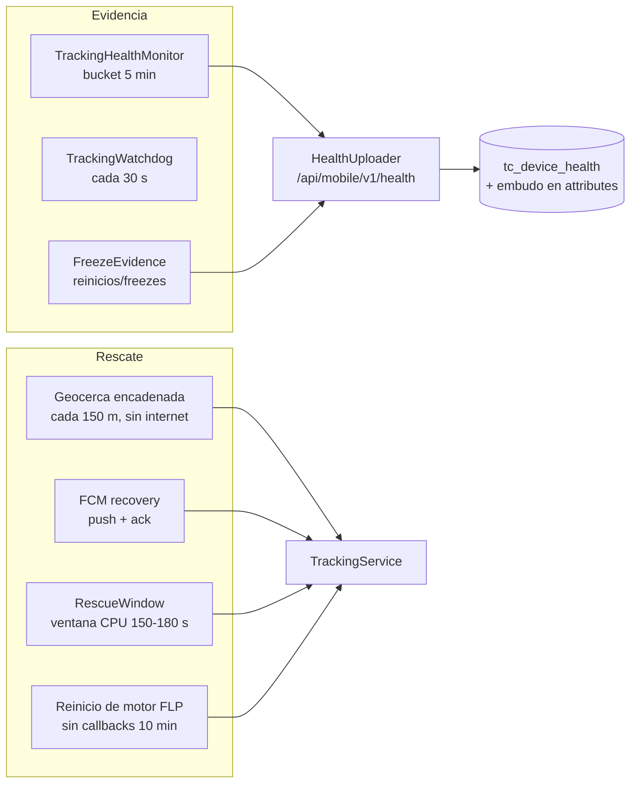

# Arquitectura de la app Android

Paquete raíz: `com.dmujeres.traccar` · minSdk 26 · Kotlin · FGS de ubicación.

## Capas y dirección de dependencias

Reglas prohibidas que el test de arquitectura verifica (resumen; detalle en
`docs/DEPENDENCY_RULES.md`):

## Flujo de captura (una jornada)

## Decisión de cadencia (F1-A)

## Salud, rescate y OEM

## Configuración remota

`data/RemoteConfig.kt` aplica al iniciar sesión lo que el panel define por
dispositivo (`/api/mobile/v1/config`): intervalo base, tamaño de cola, política de
buffer, timeouts y umbrales de filtros. Si el servidor no responde, la app conserva
los valores locales (sigue funcionando igual).
