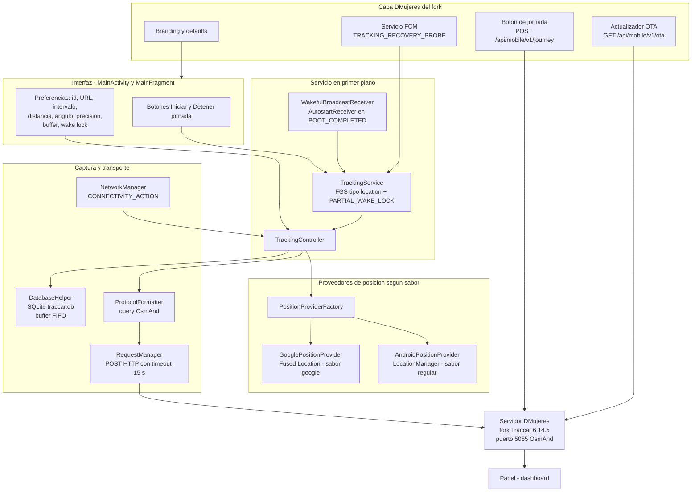
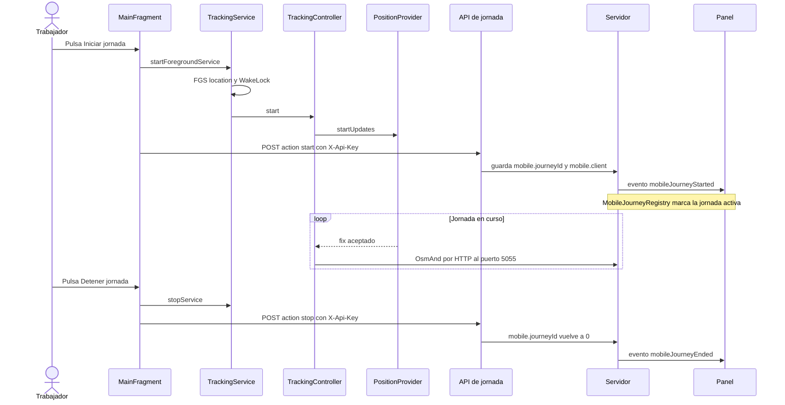
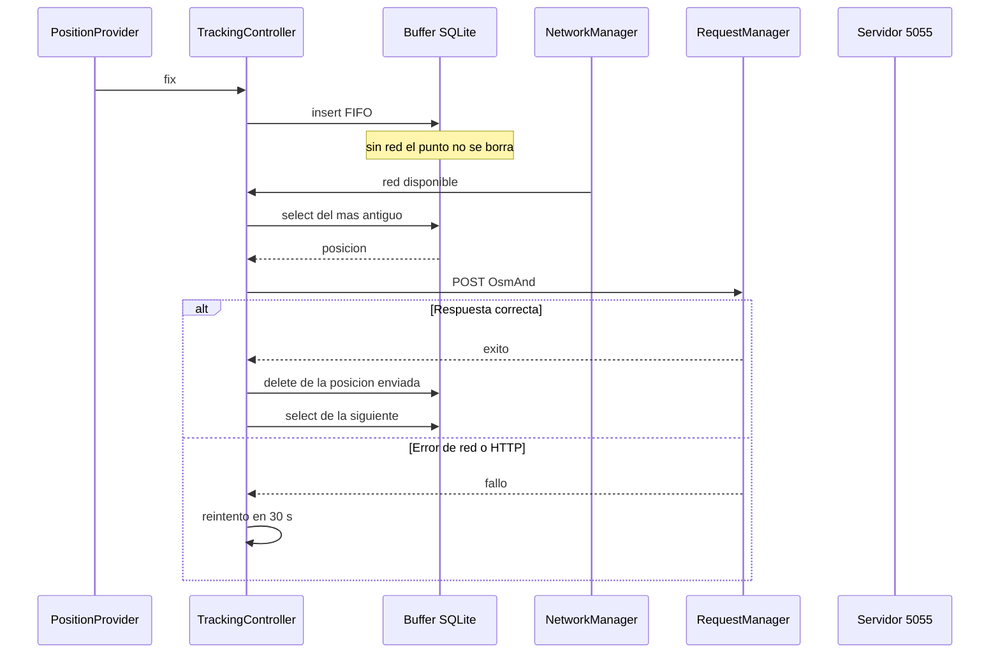
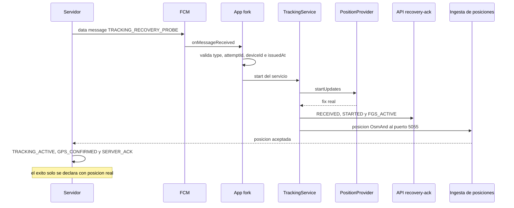

# App de respaldo (fork del cliente oficial) — auditoría gráfica

> **Base del fork:** `fallback/` es un clon del cliente oficial
> [traccar/traccar-client-android](https://github.com/traccar/traccar-client-android)
> en el commit **`190ad19`**, licencia **Apache 2.0** (`fallback/LICENSE.txt`).
> Sobre esa base se integra la capa DMujeres: branding, valores por defecto de
> ruta, botones de jornada, FCM y actualización OTA.
>
> **Identidad de reemplazo:** `com.dmujeres.traccar`, `versionCode 200`,
> `versionName 2.0.0`, firmado con `mobile/keystore/debug.keystore` (vía
> `mobile/keystore.properties`), `uniqueId macias`.
>
> **Procedimiento operativo:** `docs/EMERGENCY_FALLBACK.md`.

---

## 1. Resumen

La app de respaldo no habla los protocolos propios de la app nativa (MQTT,
`/api/mobile/v1/positions`, salud y telemetría `mobile.*`). Habla el protocolo
**OsmAnd** del servidor Traccar: un `POST` HTTP con parámetros de consulta al
puerto **5055**. Para que el panel siga viendo la jornada, el fork añade
llamadas al endpoint nuevo `POST /api/mobile/v1/journey` y reutiliza los
endpoints existentes de FCM (`/api/mobile/v1/fcm-token`,
`/api/mobile/v1/recovery-ack`) y de OTA (`/api/mobile/v1/ota`).

Lo que se conserva: **posiciones reales**, **jornada manual** con sus eventos
en el panel y **continuidad del historial** del dispositivo. Lo que se pierde
está listado sin adornos en §8.

---

## 2. Arquitectura del fork

### 2.1 Componentes y rutas reales en `fallback/`

| Componente | Archivo | Responsabilidad |
|---|---|---|
| `MainActivity` / `MainFragment` | `app/src/main/java/org/traccar/client/MainActivity.kt`, `MainFragment.kt` | Preferencias, permiso de ubicación, arranque/parada del servicio, heartbeat por `AlarmManager` |
| `TrackingService` | `.../TrackingService.kt` | Servicio en primer plano (`foregroundServiceType="location"`), wake lock parcial, `START_STICKY` |
| `TrackingController` | `.../TrackingController.kt` | Une proveedor, buffer, red y envío; retención FIFO y reintento cada 30 s |
| `PositionProviderFactory` | `.../PositionProvider.kt` y `app/src/google/.../PositionProviderFactory.kt` | Elige Fused (google) o `LocationManager` (regular) |
| `GooglePositionProvider` | `app/src/google/java/org/traccar/client/GooglePositionProvider.kt` | Fused Location con prioridad según precisión |
| `AndroidPositionProvider` | `.../AndroidPositionProvider.kt` | `LocationManager`: GPS, red o pasivo según precisión |
| `DatabaseHelper` | `.../DatabaseHelper.kt` | Buffer SQLite `traccar.db` v4, tabla `position`, FIFO por `id` |
| `ProtocolFormatter` | `.../ProtocolFormatter.kt` | Arma la query OsmAnd: `id`, `timestamp`, `lat`, `lon`, `speed`, `bearing`, `altitude`, `accuracy`, `batt` |
| `RequestManager` | `.../RequestManager.kt` | `POST` HTTP con timeout de 15 s |
| `NetworkManager` | `.../NetworkManager.kt` | Escucha conectividad y reanuda el drenaje |
| `AutostartReceiver` / `WakefulBroadcastReceiver` | `.../AutostartReceiver.kt`, `.../WakefulBroadcastReceiver.kt` | Arranque tras reinicio y wake lock de 60 s al despertar el servicio |
| `MainApplication` | `.../MainApplication.kt` | Canal de notificación del servicio |
| `Autostarter` (judemanutd) y `Doki` | `app/build.gradle` | Ayuda de autostart por OEM y guía de batería |
| Capa DMujeres | branding y defaults sobre `app/src/main/res/`; botones y llamadas de jornada; servicio FCM; actualizador OTA | Integración con el servidor propio |

---

## 3. Secuencia: inicio de jornada

Contrato verificado del endpoint (`MobileJourneyResource`):

| Aspecto | Detalle |
|---|---|
| Ruta | `POST /api/mobile/v1/journey` |
| Autenticación | `X-Api-Key` (clave actual o anterior durante rotación); canal activo solo con `mobile.http.enable=true` |
| Cuerpo | `{"deviceId":"macias","action":"start" o "stop","journeyId":<opcional>,"client":<opcional>}` |
| Respuestas | `200 {"ok":true}`; `400` cuerpo o acción inválidos; `401` clave inválida; `404` canal apagado o dispositivo desconocido |
| Efecto | Atributos `mobile.journeyId` y `mobile.client` en el device, alta/baja en `MobileJourneyRegistry` y evento `mobileJourneyStarted`/`mobileJourneyEnded` con `journeyId` |
| Idempotencia | `start` fija el `journeyId`; `stop` lo toma del cuerpo o del último guardado |

---

## 4. Secuencia: envío offline (buffer y reintento)

Notas de fidelidad del buffer (leídas del código base):

- Orden FIFO estricto (`SELECT ... ORDER BY id LIMIT 1`); nada se borra hasta
  que el `POST` devuelve éxito.
- Reintento fijo de 30 s (`TrackingController.RETRY_DELAY`); el drenaje se
  reactiva al recuperar conectividad (`NetworkManager`).
- **Sin tope ni purga por antigüedad**: el buffer crece mientras el servidor no
  esté disponible (limitación honesta, ver §8).

---

## 5. Secuencia: recuperación FCM

Detalles del canal FCM reutilizado:

| Aspecto | Detalle |
|---|---|
| Push | Data message de alta prioridad con `type=TRACKING_RECOVERY_PROBE`, `recoveryAttemptId`, `deviceId`, `issuedAt` (`FcmSender`) |
| Registro de token | `POST /api/mobile/v1/fcm-token` (`X-Api-Key` + `X-Device-Id`) |
| Etapas | `POST /api/mobile/v1/recovery-ack`: `RECEIVED`, `STARTED`, `FGS_ACTIVE`, `TRACKING_ACTIVE`, `GPS_CONFIRMED` |
| Éxito | Lo declara el servidor (`SERVER_ACK`/`SUCCESS`) **solo** cuando llega una posición real; la app no lo fabrica |
| Límite OEM | Si el proceso está congelado por la ROM, el mensaje no ejecuta código: se registra el timeout con causa, no se falsea el éxito |

---

## 6. Diferencias de build respecto de la base oficial

| Parámetro | Base oficial (`fallback/` tal cual) | Fork DMujeres (objetivo) |
|---|---|---|
| `applicationId` | `org.traccar.client` | `com.dmujeres.traccar` |
| `versionCode` / `versionName` | `90` / `7.9` | `200` / `2.0.0` |
| Firma | sin configurar en Gradle | `mobile/keystore/debug.keystore` vía `mobile/keystore.properties` (misma clave que la flota) |
| Sabor | `regular` y `google` | `google` (Fused + Firebase) |
| Idioma por defecto | inglés | español, branding DMujeres |
| Valores por defecto | intervalo 300 s, distancia 0 m, ángulo 0 grados, precisión media | intervalo 30 s, distancia 50 m, ángulo 15 grados, precisión alta |
| Buffer / wake lock | activados | activados (sin cambios) |
| Jornada | no existe | botones Iniciar/Detener que llaman a `POST /api/mobile/v1/journey` |
| Actualización | no existe | OTA contra `GET /api/mobile/v1/ota` |

---

## 7. Comparativa nativa vs app de respaldo

| Capacidad | App nativa (`mobile/`, 1.1.22 / 132) | App de respaldo (fork, 2.0.0 / 200) |
|---|---|---|
| Transporte de posiciones | MQTT+TLS primario con ACK de negocio; HTTP `/api/mobile/v1/positions` como respaldo | OsmAnd por HTTP al puerto 5055; sin MQTT |
| Buffer offline | Cola Room con retención 100 000 puntos / 7 días; borra solo con ACK | Buffer SQLite FIFO sin tope; borra con HTTP 2xx; reintento cada 30 s |
| Captura | Fused + AOSP, sensores de movimiento, watchdog, ventana de rescate, geocerca encadenada | Fused (google) o `LocationManager` (regular) con intervalo/distancia/ángulo; FGS + wake lock |
| Jornada manual | Botones propios + presencia MQTT + resumen de cierre | Botones propios + `POST /api/mobile/v1/journey`; mismos eventos y estados en el panel |
| Eventos en el panel | `mobileJourneyStarted/Ended` y alertas propias de la app | `mobileJourneyStarted/Ended` (los mismos) |
| Salud y embudo F0 | Embudo por bucket de 5 min, snapshots de salud, diagnósticos, atributos `mobile.*` | No los envía |
| Recuperación | Escalera 0-5 (self-recovery, worker, alarma, boot, acción de usuario) + FCM F2 con ACK por etapas | FGS + wake lock + autoarranque OEM + FCM con reuso de endpoints |
| OTA | `UpdateChecker` + `OtaVersionPolicy` (versionCode, sin downgrade) | Actualizador propio contra el mismo endpoint |
| Crash/analítica | Sentry | Firebase Crashlytics y Analytics (sabor google) |
| Replay "medido/estimado" | El panel lo marca con datos de salud | Solo posiciones reales; sin etiqueta de estimado |
| Alertas propias de la app | Sí (campanita, causas confirmadas/posibles) | No |
| Permisos y OEM | Onboarding, `PermissionHealth`, guías por fabricante | Permisos estándar + AutoStarter + Doki; sin onboarding propio |

---

## 8. Limitaciones honestas

1. **Sin embudo de salud F0**: no hay `tc_device_health` ni `v_device_funnel_daily`
   para este equipo; la **Cobertura30 porcentual no aplica**. La verificación
   diaria es `infrastructure/sql/cobertura30_diaria.sql` (mediana/p95 del
   intervalo en movimiento, huecos > 120 s) y el reporte de jornadas.
2. **Sin telemetría `mobile.*`**: el panel no tendrá batería, red, GPS, sesión
   MQTT ni cola pendiente de la app de respaldo. Solo posiciones y eventos de
   jornada.
3. **Sin alertas propias de la app nativa**: los avisos que dependen del canal
   móvil propio (`mobileNetworkLost`, `mobilePossiblePowerOff`, etc.) no se
   generan para este equipo.
4. **Sin replay "medido/estimado"**: el panel dibuja lo medido; no hay etiqueta
   de tramo estimado porque no hay señal de salud que lo sustente.
5. **Sin MQTT**: se pierden presencia en vivo, LWT y el ACK de negocio por
   mensaje. La entrega se apoya en el reintento HTTP.
6. **Buffer sin tope**: riesgo de llenar almacenamiento si el servidor está
   caído muchos días (ver `docs/EMERGENCY_FALLBACK.md` §7.2).
7. **Jornada dependiente del endpoint**: si `POST /api/mobile/v1/journey`
   falla, hay posiciones pero el panel no marca la jornada. El fork reintenta
   contra su propio buffer.
8. **FCM no vence a la ROM**: en equipos con congelamiento (por ejemplo ZTE
   MyOS) un push de alta prioridad no ejecuta código si el proceso está
   congelado; el sistema registra el timeout con causa, sin falsear éxito.
9. **Firma de flota compartida**: la clave `debug.keystore` es pública y
   conocida (ver `docs/security/INCIDENT_secretos_zip.md`). Es el mismo riesgo
   que ya tiene la app nativa; rotarla exige ventana coordinada.
10. **Sin distribución por tienda**: la actualización es por OTA propio; no hay
    Play Store ni Play Integrity.

---

## 9. Licencia y avisos

- **Licencia:** Apache License 2.0 (`fallback/LICENSE.txt`). El fork se
  distribuye bajo la misma licencia.
- **Avisos conservados:** los encabezados de copyright y licencia de los
  archivos originales de Anton Tananaev se mantienen en los archivos derivados;
  no se eliminan ni se sustituyen.
- **Commit base documentado:** `190ad19` de
  `https://github.com/traccar/traccar-client-android` (este documento es el
  registro de esa base; conviene repetirlo en las notas de release del fork).
- **Estado del repositorio base:** el README del clon advierte que ese
  repositorio es la versión antigua del cliente y que el desarrollo migró a
  `traccar/traccar-client`. Se usa como base por su estabilidad y porque es la
  que se clonó en `190ad19`; cualquier actualización futura de la base debe
  revalidar §6 y §8.
- **Sin secretos en el APK** salvo la llave compartida de flota por diseño
  (`X-Api-Key`), igual que la app nativa; la cuenta de servicio de FCM vive solo
  en el servidor (`GOOGLE_APPLICATION_CREDENTIALS`).

---

## 10. Referencias

| Tema | Documento |
|---|---|
| Procedimiento de emergencia y rollback | `docs/EMERGENCY_FALLBACK.md` |
| Arquitectura de la app nativa | `docs/architecture/APP.md`, `docs/architecture/FLUJOS.md` |
| Recuperación FCM del servidor | `docs/fcm-recovery.md` |
| Métrica Cobertura30 | `docs/audit/COBERTURA30_METRIC.md`, `infrastructure/sql/cobertura30_diaria.sql` |
| OEM y batería | `docs/OEM_COMPATIBILITY.md`, `docs/audit/OEM_BACKGROUND_AUDIT.md` |
| Firma y secretos | `docs/SECURITY_BUILD.md`, `docs/security/INCIDENT_secretos_zip.md` |
| OTA y rollout | `infrastructure/scripts/publish-ota.sh`, `dashboard/public/rollout.json` |

## Onboarding y modo bloqueado (2.0.x)

- **Primer arranque**: `OnboardingActivity` con dos pasos — login pre-rellenado
  (usuario/servidor vienen de fábrica; solo editables en modo avanzado) y panel de
  permisos (ubicación, ubicación siempre, notificaciones, batería sin restricción,
  inicio automático del fabricante) con estado visual por fila.
- **Modo normal**: la pantalla principal NO muestra configuración (ni URL, ni
  precisión, ni intervalos): solo "Servicio activo" y la versión. La captura queda
  siempre encendida (`KEY_STATUS=true` al terminar el onboarding y en cada arranque).
- **Acceso avanzado**: 5 toques seguidos en la versión (misma política que la app
  nativa: hueco máximo 1,2 s, ventana 4 s) habilitan la configuración real;
  mantener presionada la versión lo vuelve a ocultar.
- **Configuración de fábrica**: id `macias`, servidor `http://68.168.20.219:5055`,
  intervalo 30 s, distancia 50 m, ángulo 15°, precisión alta, buffer y wake lock ON
  (escrita por `PreferenceManager.setDefaultValues` al arrancar la app y con los
  mismos valores como respaldo en el código del proveedor de ubicación).
