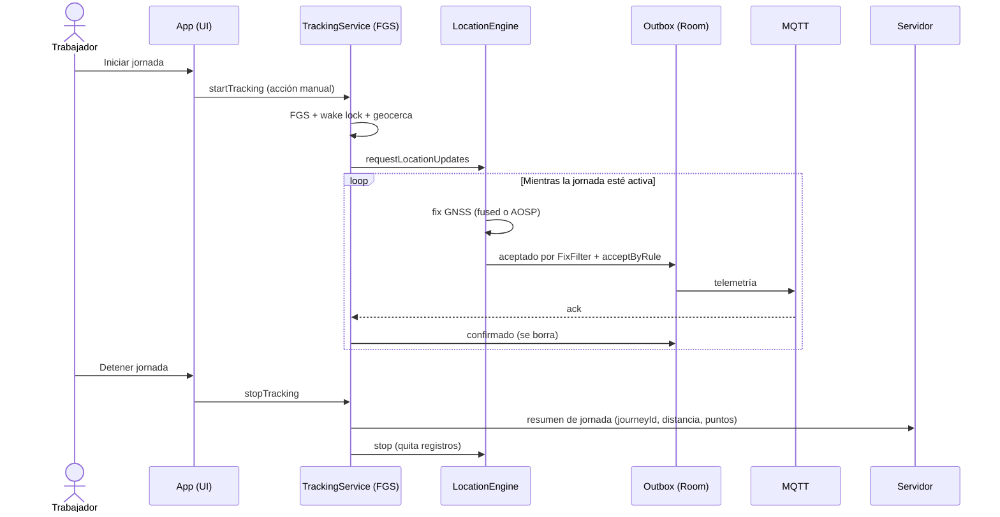
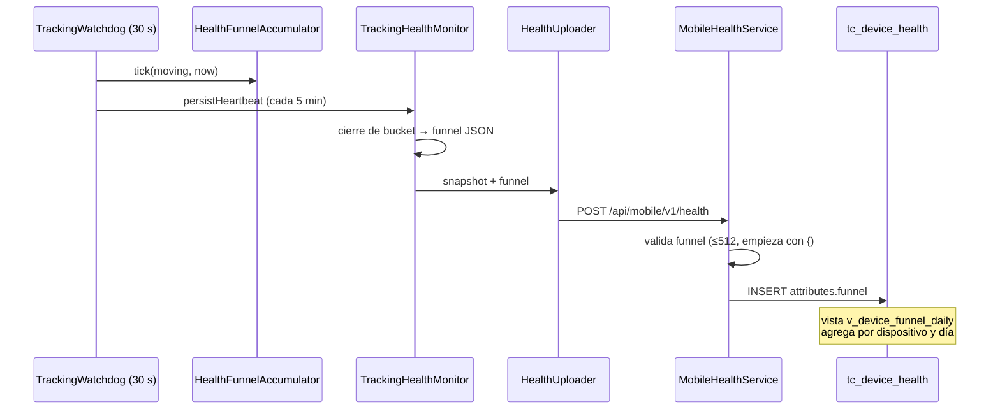
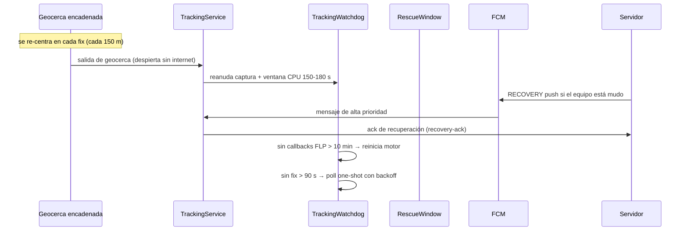
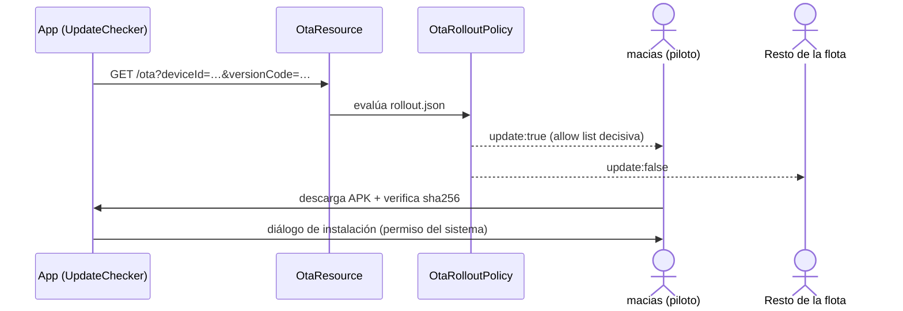
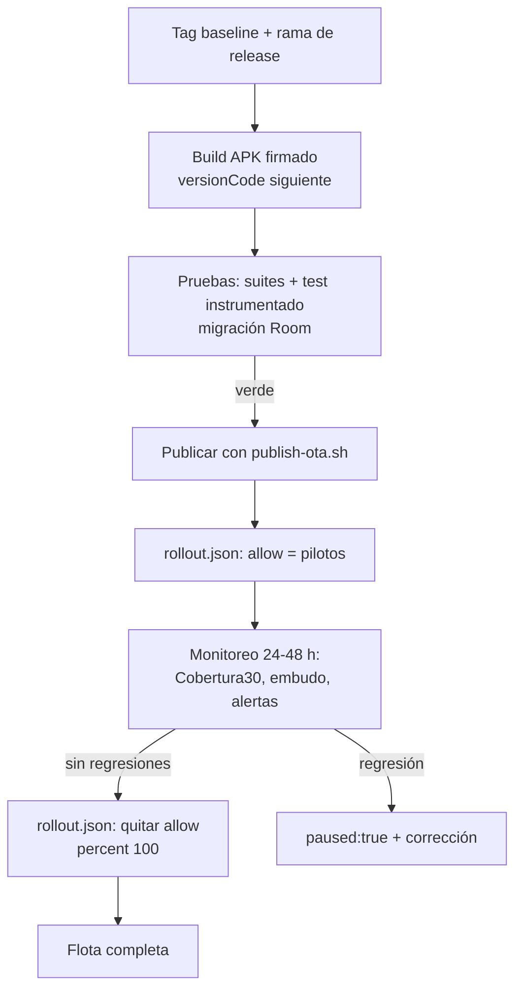

# Flujos (secuencias auditables)

## 1. Jornada manual (inicio → captura → fin)



## 2. Posición cuando no hay red (offline)

```mermaid
sequenceDiagram
    participant L as LocationEngine
    participant O as Outbox (Room)
    participant D as PositionOutboxDispatcher
    participant H as HTTP trickle
    participant MQ as MQTT

    L->>O: fix aceptado (sin red)
    Note over O: la cola retiene; nada se pierde<br/>mientras la jornada siga viva
    D->>D: red disponible (ConnectivityObserver)
    D->>MQ: lote por MQTT
    alt MQTT sin ack
        D->>H: trickle HTTP /positions
        H-->>D: 200 OK
    end
    D->>O: confirmados → se borran
```

## 3. Embudo de salud (F0)



## 4. Rescate (GPS caído / proceso congelado)



## 5. OTA en modo piloto



## 6. Liberación a toda la empresa (procedimiento)


