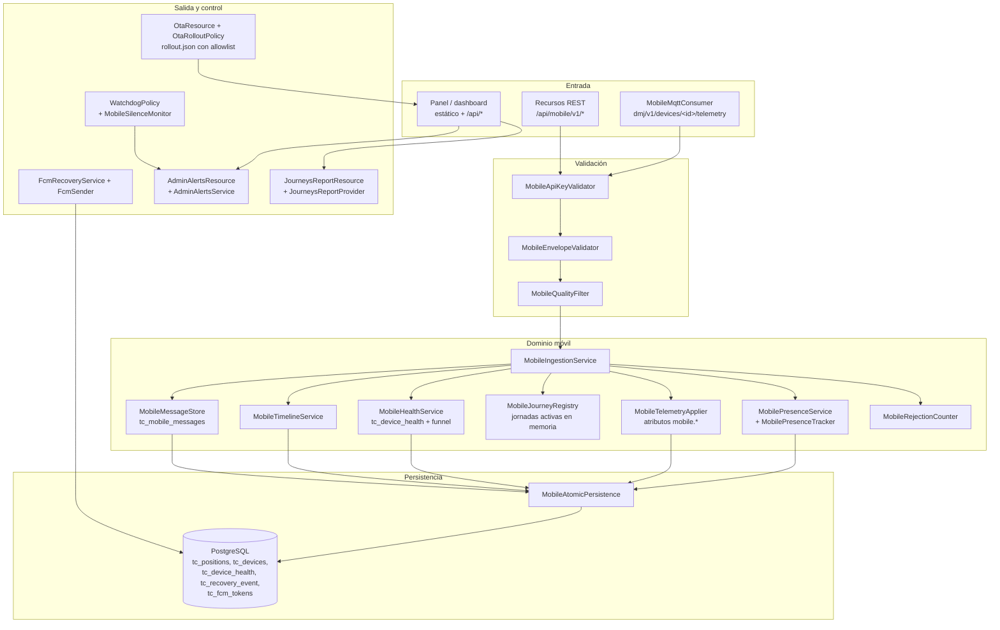
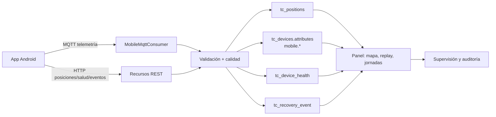
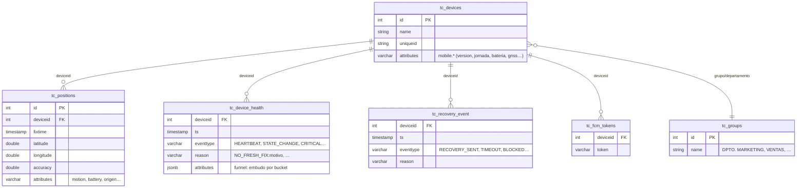
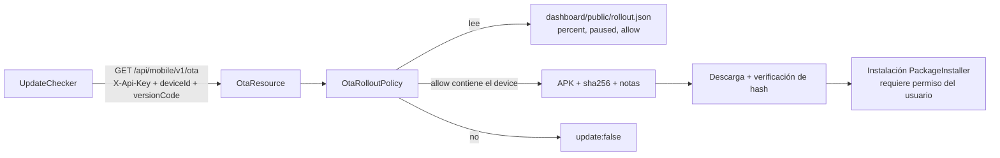

# Arquitectura del servidor

Fork de Traccar 6.14.5 (`server/`), con el módulo propio `org.traccar.mobile`.
Puerto web único **999** (API + panel estático) y broker MQTT.

## Módulos

## Ingesta y rutas de datos

## Modelo de datos propio

## Alertas y control (panel)

| Fuente | Regla | Severidad |
|---|---|---|
| `journey-silence` | jornada activa sin reportar > 10 min / > 30 min | warning / critical |
| `device-health` | `PROCESS_FREEZE_DETECTED` o `CRITICAL` en 24 h | critical |
| `recovery` | `RECOVERY_TIMEOUT` / `RECOVERY_BLOCKED` en 24 h | warning / critical |
| `health-funnel` | jornada activa, equipo vivo y sin buckets de embudo > 24 h / > 48 h (solo ≥ 1.1.22) | warning / critical |
| `backup` / `disk` / `watchdog` | respaldo > 24/36 h, disco > 75/90 %, watchdog | warning / critical |

## OTA (piloto → flota)

**Nota de política**: las notas de release visibles al usuario son solo
`Actualizar a la versión 1.x.x` (sin descripciones técnicas).
